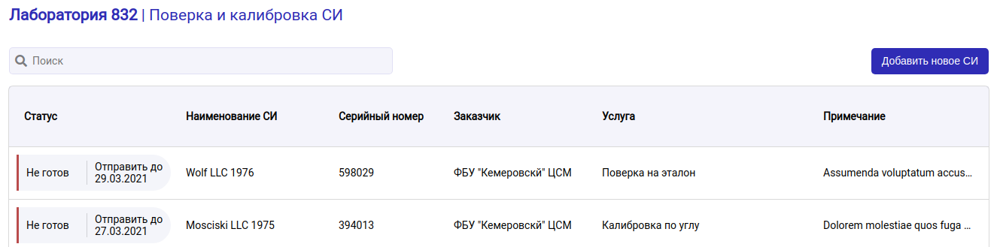

# Geodyssey

Basic CRUD-application for measurment instrument management.



Stack:

* Frontend: vuejs
* Backend: MarbleJS
* DB: postgresql

## Development

To run API use node:

```bash
$ npm run start:server
```

To run UI use npm (or yarn):

```bash
$ npm install
$ npm start
```

To run database install PostgreSQL or use Docker Compose (inside `./sql`) directory:

```bash
$ docker-compose up -d
```

Database with tables will be created at server startup.
